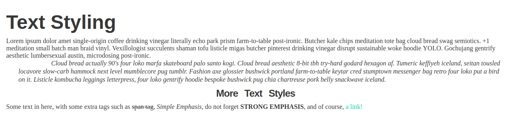

# Basic Typography Exercises

## Exercise: Text styling and formatting

**Instructions**:

* Change the body's font color and font family. Use a fallback system.
* Change the headings' font family, use a fallback system and make them bold.
* Make the `<h1>` 3 times the size of the base font-size.
* Make the `<h2>` 2 times the size of the base font-size.
* Make the `<h3>` 1.5 times the size of the base font-size. Center this element.
* Make the blockquote italic, give it a paragraph indentation,and give it some space between the lines.
* Cross out the .
* Make the <em>'s words all start with a capital letter.
* Make the <strong> all capital and bold.
* Change the color of the link and get rid of the underline.

**Bonus**: 
* Decrease the space between the `<h3>`'s letters and increase the space between its words.

